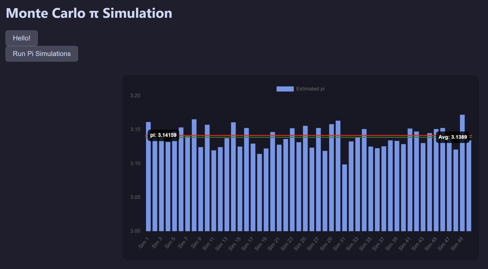

# Rust webapp
Simplist webapp in `Rust` with `Axum` and `Chart.js`, written to establish a skeleton template for a static `HTML/CSS/JS` file based webapp with parallelised computing with `Rayon` in the backend.

## Screenshot

## Usage
Simply run `cargo run` and navigate to `localhost:3000` in your browser of choice.